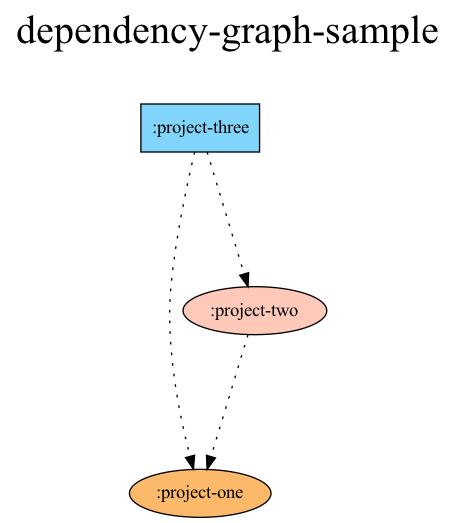

# dependency-graph-plugin

A simple Gradle plugin that shows the dependency graph of the project.



---

## Download 

```gradle
plugins {
    id("land.sungbin.dependency.graph.plugin") version "$version"
}
```

## Usage

1. Download [graphviz](https://graphviz.org/download/).
2. Setting `dependencyGraphConfigs`.
3. Run `./gradlew dependencyGraph`.

```kotlin
dependencyGraphConfigs {
    /**
     * The path where the dot file of the graph will be generated.
     * The png of the graph is generated along this path, too.
     *
     * Default is "generated/dependency-graph/project.dot".
     */
    dotFilePath = "generated/dependency-graph/project.dot"

    /**
     * Whether to automatically delete the dot file after
     * the png is created from the dot file of the graph.
     *
     * Default is `true`.
     */
    autoDeleteDotFile = true

    /**
     * Name to be displayed at the top of the graph.
     *
     * Default is `null`.
     * `null` means: `${project.rootProject.name}`
     */
    projectName = null // String type 

    /**
     * The default **Hex** color to use when graphing uncolored dependencies.
     *
     * Defaults to `#eeeeee`, skipped graphing if `null` is provided.
     */
    defaultDependencyColor = "#eeeeee" // String? type

    /**
     * **[REQUIRE]** Add dependency information to the graph.
     *
     * @param builder The lambda that calculates the dependency information.
     *  - project: Instances of the [project][Project] to compute information
     *
     * @return A dependency information object. See [DependencyInfo].
     */
    fun dependencyBuilder(builder: (project: Project) -> DependencyInfo?)
}

/**
 * A dependency information object.
 *
 * @param color **Hex** color of the dependency
 * @param isBoxShape Whether that dependency will be displayed as a rectangle on the graph.
 * The default value is `false`, and in case of `false`, it is displayed as an oval.
 */
data class DependencyInfo(
    val color: String,
    val isBoxShape: Boolean = false,
)
```

#### Example

> You can check sample project at [here](sample).

```kotlin
// example 1
dependencyGraphConfigs {
    dependencyBuilder { project ->
        with(project.plugins) {
            when {
                hasPlugin("project.three") -> DependencyInfo("#81d4fa", isBoxShape = true)
                hasPlugin("project.two") -> DependencyInfo("#ffc9ba")
                hasPlugin("project.one") -> DependencyInfo("#fcb96a")
                else -> null
            }
        }
    }
}

// example 2
dependencyGraphConfigs {
    dependencyBuilder { project ->
        with(project) {
            when {
                plugins.hasPlugin(PluginEnum.AndroidApplication) -> DependencyInfo("#baffc9", isBoxShape = true)
                plugins.hasPlugin(PluginEnum.AndroidDfm) -> DependencyInfo("#c9baff")
                plugins.hasPlugin(PluginEnum.JavaLibrary) -> DependencyInfo("#ffc9ba")
                name.startsWith(UtilModulePrefix) -> DependencyInfo("#ffebba")
                name.startsWith(FeatureModulePrefix) && !name.contains(OnlyUiFeatureModulePrefix) -> DependencyInfo("#81d4fa")
                name.startsWith(UiFeatureModulePrefix) -> DependencyInfo("#00aeff")
                plugins.hasPlugin(PluginEnum.AndroidLibrary) -> DependencyInfo("#fcb96a")
                else -> null
            }
        }
    }
}
```

## Credit

The original implementation is by [JakeWharton](https://github.com/JakeWharton/SdkSearch/blob/master/gradle/projectDependencyGraph.gradle).

## License

This project is licensed under the MIT License. Please refer to the [LICENSE file](LICENSE) for details.
